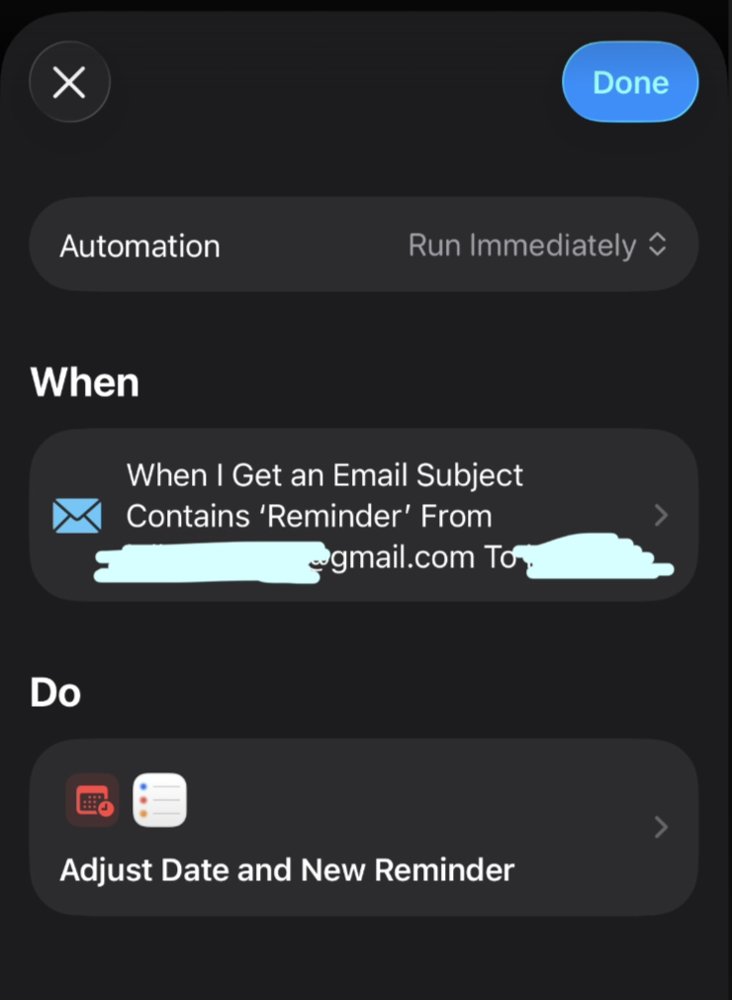
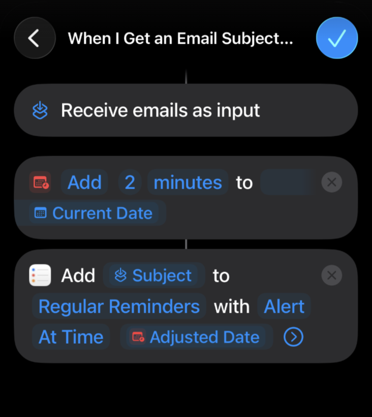

# Calendar Email Reminder

## 💡 Background & Motivation

Do you use alarm to remind yourself of important events because the pop notification is not effective at all? Same here! I want a persistent alarm to get my attention! But there are times (actually MANY times) I forgot to turn off those alarms scheduled for a specific workday since I turn it on for repeat alarm and luckily the iPhone reminder has an option to set alert as urgent which uses actual alarm instead of a quick pop notification! But then if I had to manually add each of the important events into reminder that also takes additional time. So that's how this mini project is born with assistance from Copilot. And I combo this with the shortcut automation on iPhone to automate the reminder alarm. Instructions on reminder automation at the bottom of this file.

## 🎯 What It Does

Automatically sends email reminders for Google Calendar events tagged with red color, approximately 10 minutes before they start. These emails can trigger iPhone Shortcuts automation to create urgent reminders with real alarm sounds!

## Features

- 🔴 Monitors Google Calendar for events with red color tags
- ⏰ Sends email reminders 7-12 minutes before event start time
- 📧 Uses Gmail SMTP for reliable email delivery
- 🔒 OAuth 2.0 authentication for secure Google Calendar access
- 📝 Tracks sent notifications to avoid duplicates (handles rescheduled events)
- 🔄 Designed to run every 5 minutes via cron job
- 📱 Works seamlessly with iPhone Shortcuts automation

## Prerequisites

- Python 3.11 or higher
- A Google account with Google Calendar
- Gmail account with 2-factor authentication enabled
- Google Cloud Project with Calendar API enabled

## Setup Instructions

### 1. Google Cloud Setup

1. Go to [Google Cloud Console](https://console.cloud.google.com/)
2. Create a new project or select an existing one
3. Enable the Google Calendar API:
   - Go to "APIs & Services" > "Library"
   - Search for "Google Calendar API"
   - Click "Enable"
4. Create OAuth 2.0 credentials:
   - Go to "APIs & Services" > "Credentials"
   - Click "Create Credentials" > "OAuth client ID"
   - Select "Desktop app" as application type
   - Download the credentials JSON file
   - Rename it to `credentials.json` and place it in the project root directory

### 2. Gmail App Password

1. Go to your [Google Account settings](https://myaccount.google.com/)
2. Navigate to "Security" > "2-Step Verification" (enable it if not already)
3. Scroll down to "App passwords"
4. Generate a new app password for "Mail"
5. Save this 16-character password for the next step

### 3. Environment Configuration

1. Copy the example environment file:
   ```bash
   cp .env.example .env
   ```

2. Edit `.env` and fill in your details:
   ```
   GMAIL_ADDRESS=your-email@gmail.com
   GMAIL_APP_PASSWORD=your-16-char-app-password
   RECIPIENT_EMAIL=recipient@example.com
   CALENDAR_ID=primary
   NOTIFICATION_FILE=.sent_notifications.json
   ```

### 4. First Run & Authentication

1. Activate your virtual environment:
   ```bash
   source .venv/bin/activate
   ```

2. Run the script for the first time:
   ```bash
   python main.py
   ```

3. Your browser will open for Google OAuth authorization
4. Grant the necessary permissions
5. A `token.json` file will be created to store your credentials

## Usage

### Manual Run

```bash
python main.py
```

### Automated Run (Every 5 minutes)

Set up a cron job to run the script every 5 minutes:

```bash
crontab -e
```

Add this line (adjust paths to your setup):

```cron
*/5 * * * * cd /home/jinglu/workspace/calendar_email_reminder && /home/jinglu/workspace/calendar_email_reminder/.venv/bin/python /home/jinglu/workspace/calendar_email_reminder/main.py >> /home/jinglu/workspace/calendar_email_reminder/cron.log 2>&1
```

### How to Tag Events as Red

In Google Calendar:
1. Create or edit an event
2. Click on the event color dropdown
3. Select the red color (🔴)
4. Save the event

The script will detect these red-tagged events and send reminders 7-12 minutes before they start.

## Project Structure

```
calendar_email_reminder/
├── main.py                    # Main script with reminder logic
├── calendar_auth.py           # Google Calendar authentication & API
├── email_sender.py            # Email sending functionality
├── .env                       # Environment variables (not in git)
├── .env.example               # Environment template
├── credentials.json           # Google OAuth credentials (not in git)
├── token.json                 # OAuth token (auto-generated, not in git)
├── .sent_notifications.json   # Tracks sent notifications (not in git)
├── pyproject.toml            # Project dependencies
└── README.md                  # This file
```

## Troubleshooting

### "credentials.json not found"
- Ensure you downloaded the OAuth credentials from Google Cloud Console
- Place it in the project root directory

### "Authentication failed"
- Delete `token.json` and run the script again to re-authenticate
- Check that your Google Cloud project has Calendar API enabled

### "Email sending failed"
- Verify Gmail app password is correct (16 characters, no spaces)
- Ensure 2-factor authentication is enabled on your Google account
- Check that GMAIL_ADDRESS and GMAIL_APP_PASSWORD are set in `.env`

### No emails received
- Verify events are tagged with red color in Google Calendar
- Check that events are scheduled to start in the next 7-12 minutes
- Run the script manually to see debug output
- Check spam folder for emails

## 📱 iPhone Shortcuts Automation Setup

This is where the magic happens! Set up iPhone Shortcuts to automatically create urgent reminders when you receive the calendar email.

### Step 1: Open Shortcuts App
1. Open **Shortcuts** app on your iPhone
2. Tap **Automation** tab at the bottom
3. Tap **+** (top right) → **Create Personal Automation**

### Step 2: Configure Email Trigger
1. Scroll down and select **Email**
2. Configure trigger settings:
   - **Sender:** Enter your Gmail address (the one sending reminders)
   - **Subject Contains:** `⏰ Reminder:`
   - **Run Immediately:** Toggle ON (no confirmation needed)




### Step 3: Build the Shortcut Actions

Tap **Next** and add these actions in sequence:

#### Action 1: Get Email Details
- Search and add: **Get Details of Email**
- Set to get: **Subject**

#### Action 2: Adjust time 
- Search action and add: "adjust date" 
- Add some additional time to the current date to so that the reminder alarm can be triggered in the future

#### Action 3: Create Reminder with Urgent Alert
- Add: **Add New Reminder**
- Configure:
  - **Title:** Use the email subject from previous step
  - **List:** Choose your preferred list (e.g., "Reminders")
  - **Alert:** Choose **adjusted time** and set to urgent by tapping on the info icon on the size 


### Step 4: Test & Enable
1. Tap **Done** to save the automation
2. Send yourself a test email with subject: `⏰ Reminder: Test Event in 10 minutes`
3. Verify the automation triggers and creates a reminder
4. Once working, ensure "Run Immediately" is ON for seamless automation


## Security Notes

- Never commit `.env`, `credentials.json`, or `token.json` to version control
- The `.gitignore` file is configured to exclude sensitive files
- OAuth tokens expire after some time and will auto-refresh

## License

MIT License

## Contributing

Feel free to submit issues and enhancement requests!